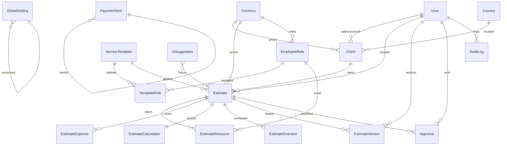

# ER Diagram

## Core tables

- **users** — JWT principals + RBAC roles
- **employee_roles** — cost/billing rates (configurable)
- **global_settings** — target margin, taxes, capacity, market rates
- **service_templates** / **template_roles** — defaults from Excel services
- **clients** — commercial accounts
- **estimates** — draft → review → approved → won/lost
- **estimate_resources** / **estimate_expenses** — inputs
- **estimate_calculations** — persisted engine output
- **estimate_scenarios** / **estimate_versions** — comparison + audit
- **approvals** / **audit_logs** — workflow + system trail
- **ai_suggestions** — reserved for future AI features
